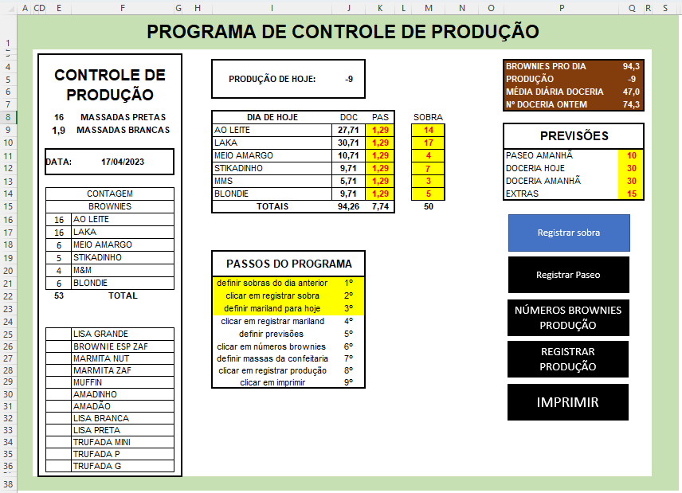
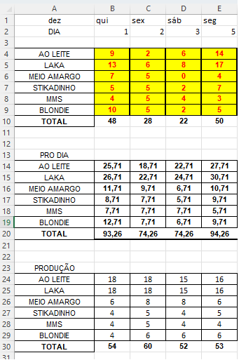
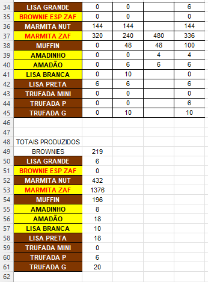

<h1 align="center">Projeto elaborado em VBA</h1>

## Nesse repositório você encontra um controle de produção completo.

### Essa linguagem foi a minha porta de entrada para a programação. Todos os projetos desenvolvidos em VBA viabilizaram um maior controle e automatização da produção.   

 # :chocolate_bar: Uma breve descrição:

### Este projeto foi desenvolvido em 2020 por mim enquanto eu ocupava o cargo de Supervisor de Produção na empresa Charlie Brownie, uma fábrica de brownies de Porto Alegre.  Assim que eu assumi o cargo, em janeiro de 2020, me preparei para desenvolver métodos de controle e acompanhamento da produção. Nesse contexto, comecei a estudar VBA para transformar as planilhas de Excel em programas automatizados e de fácil manipulação, para que tanto quanto as pessoas dentro da produção pudessem utilizar.
 

# :computer: Interface da aplicação

### Esse programa é utilizado pelo usuário na própria tela do Excel; Na tela podemos ver os botões em preto, sendo que o botão em azul é o ativo; As células com escrita vermelha e fundo amarelo são as editáveis pelo usuário; O passo atual do programa fica pintado de amarelo para o usuário saber onde está; O Controle de Produção é impresso em uma impressora de comandas;

# :notebook_with_decorative_cover: Passos de utilização do programa:

- Preencher as sobras de brownie do dia anterior e clicar no botão *Registrar Sobra*
- Definir as quantidades que vão para a loja de Revenda e clicar no botão de *Registrar Revenda*;
- Definir as previsões de quantidades para o dia seguinte;
- Clicar em *NÚMEROS DE BROWNIES PRODUÇÃO*;
- O programa então irá calcular a quantidade a aser produzida;
- Clicar em *Registrar Produção*;
- O programa irá registrar a produção automaticamente dessa forma:

- Por fim o usuário deve clicar em *Imprimir*;
- A comanda de impressão sairá na impressora de comandas definida.

----------

# :memo: Outros Projetos:

1. Sistema de controle de produção simplificado 
2. Sistema de Impressão de comandas
3. Controle de estoque e produção de datas comemorativas
4. Projeto desenvolvido para IT Academy 18
----------

Sempre quero me desenvolver, portanto estou aberto a sugestões, críticas, elogios, etc. Muito obrigado!
